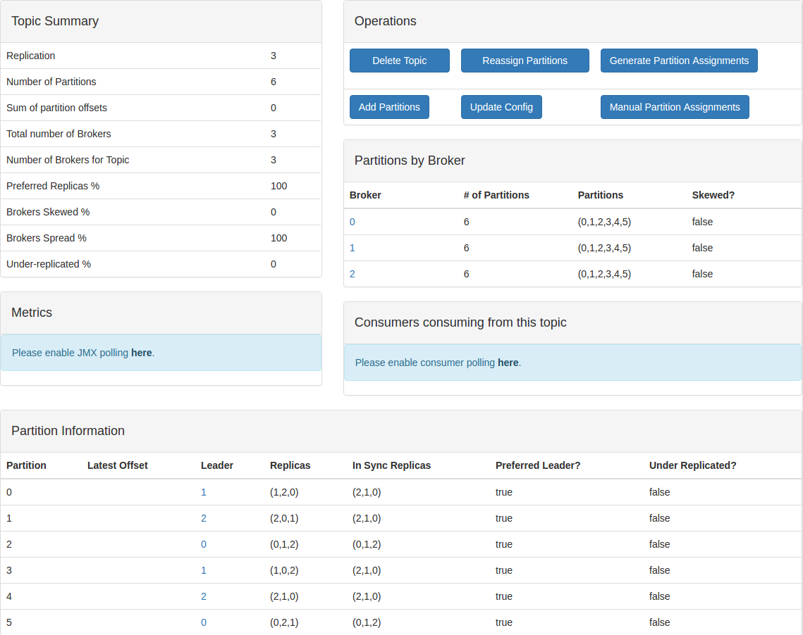
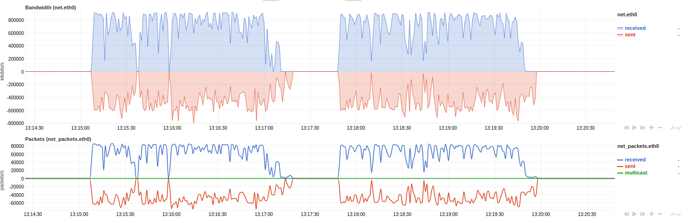
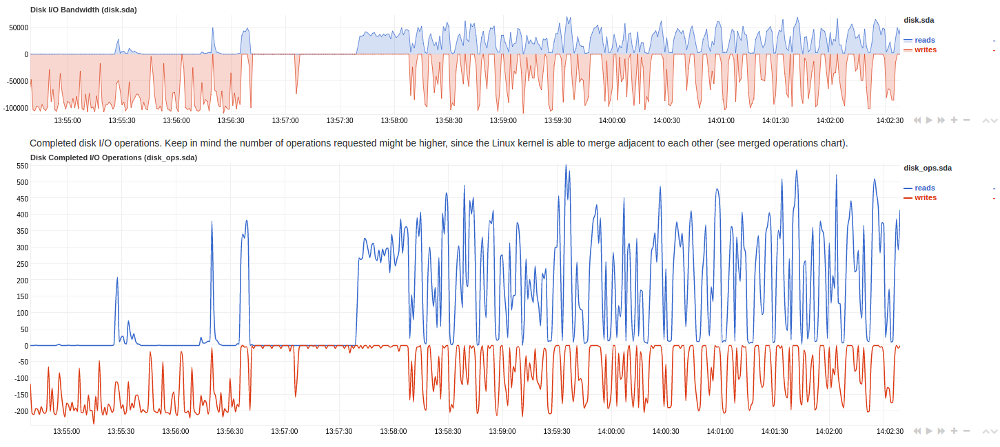

## Kafka 压力测试

### 目的 ###

测试消息大小在 100K 至 1M 区间内，测试 Kafka 的写性能，以确认其是否可以支撑 __每天千万级的消息(百K大小)写入__ 需求。
同时还需要对Kafka 在消息的其他大小维度上的性能有一定了解，使得之后在架构上对 Kafka 的位置有一定了解。

### 搭建 Kafka 测试环境 ###

#### 硬件配置 ####

CPU: 2 core

Memory: 8G

Disk: 1T SATA。

`fio --randrepeat=1 --ioengine=libaio --direct=1 --gtod_reduce=1 --name=test --filename=test --bs=4k --iodepth=8 --size=4G --readwrite=randwrite --runtime=60`

* 4K, iodepth=1 => 160 iops, 约 640 KB/s
* 1M, iodepth=1 => 40 iops, 约 40000 KB/s

Network: 公司内网 1Gb。


#### 软件配置 ####

ZK  使用 Docker 启动：

```
$ docker-compose up -d
$ docker-compose ps
```

Kafka 通过 ansible 配置，部署在 Host 上。 版本： 0.10.1.0。

在默认的 Broker 设置基础上，修改了如下参数：(参见 [config/server.properties](./config/server.properties))

- message.max.bytes: 1000012 => 5242880
- socket.receive.buffer.bytes: 102400 => 1048576
- socket.send.buffer.bytes: 102400 => 1048576
- num.network.threads: 3 => 4

### Topic 设置: 3 Replication, 6 partition ###


``` shell

bin/kafka-topics.sh --create --zookeeper localhost:2181/kafka-test \
 --replication-factor 3  --partitions 6 --topic three-replication
```



### 测试命令 ###

* 使用 kafka 自带的 `bin/kafka-producer-perf-test.sh`，主要参数：
  * num-records: 总共发送的消息个数
  * record-size: 消息大小（byte）
  * throughput: 最大的吞吐量 messages/sec，用来限制测试的吞吐量
  * producer-props: Producer 的配置（本次的 Benchmark 均使用默认的设置）

### 测试过程 ###

#### Single Producer ####

消息大小在 100B, 1KB, 10KB, 100KB, 500KB, 1MB 时的最大吞吐量：

- 100B: 104857600 records sent, 681716.878828 records/sec (65.01 MB/sec), 360.95 ms avg latency, 2591.00 ms max latency, 192 ms 50th, 1184 ms 95th, 1808 ms 99th, 2462 ms 99.9th
- 1KB: 10485760 records sent, 91319.486175 records/sec (87.09 MB/sec), 333.74 ms avg latency, 3477.00 ms max latency, 201 ms 50th, 1172 ms 95th, 1696 ms 99th, 3367 ms 99.9th.
- 10KB: 1048576 records sent, 9169.481002 records/sec (87.45 MB/sec), 220.37 ms avg latency, 5273.00 ms max latency, 96 ms 50th, 660 ms 95th, 1417 ms 99th, 5268 ms 99.9th.
- 100KB: 104857 records sent, 939.023517 records/sec (89.55 MB/sec), 353.97 ms avg latency, 2158.00 ms max latency, 138 ms 50th, 1245 ms 95th, 1782 ms 99th, 2130 ms 99.9th.
- 500KB: 20971 records sent, 187.599521 records/sec (89.45 MB/sec), 360.41 ms avg latency, 3365.00 ms max latency, 251 ms 50th, 1070 ms 95th, 1790 ms 99th, 3333 ms 99.9th.
- 1MB: 10485 records sent, 93.135426 records/sec (88.82 MB/sec), 362.09 ms avg latency, 3073.00 ms max latency, 185 ms 50th, 1066 ms 95th, 1673 ms 99th, 2946 ms 99.9th


netdata 监测到的网络和磁盘使用情况:




另外，Broker 的 page cache 8G 用了6G 左右。

* 针对几十K大小的消息，网络和磁盘基本都是满的。
* 瓶颈主要在于磁盘，IO慢导致延迟增加，并且异步复制也会明显变慢。
* 另外，如果磁盘跟的上，带宽很快也会成为瓶颈。

#### Single Producer, Single Consumer ####


netdata 监测到的网络和磁盘使用情况：

* 前半段是只有 producer 时的情况。后半段是 producer 和 consumer 同时运行时的情况。
* 有 consumer 时，读写各占一半，写延迟增加了一倍。
  * 1MB: 10485 records sent, 36.279021 records/sec (34.60 MB/sec), 929.46 ms avg latency, 9295.00 ms max latency, 306 ms 50th, 4292 ms 95th, 6290 ms 99th, 9068 ms 99.9th.




* 因为三台机器上都有 partition，而且还是 three replicas，一边读一边写势必导致读写各自都减半。
* 保持 three replicas 不变，增加 brokers 会缓解读写竞争的情况。


### 结论 ###

大致可以得到：

100B, 1KB, 10KB, 100KB, 500KB, 1MB 消息大小时，在保证平均几十 ms的延迟下，
吞吐量分别在 65w, 9w, 9000, 900, 170, 90 records/sec 左右。

#### 资源估算 ####

1000_0000 / 3600 / 12 = 232 requests/sec

高峰期按照平均流量的10倍估算，需要承受最大 2300 rps 的流量，需要 4~30 台 kafka 机器(普通PC配置)
（具体数字可根据线上图片大小做具体配置，看是100K偏多，还是1M偏多）。

假设平均每个请求 400KB，高峰期带宽需 400K * 2300 ~= 1GB。

每天积累数据 1000_0000 * 400K ~= 4T 左右的数据。
