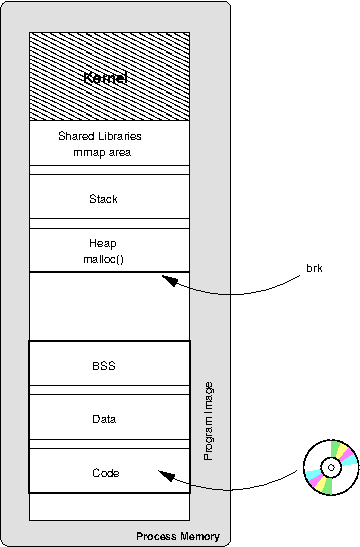

# 外设和总线

- 外设通过总线和处理器相连。
- 设备通过发送中断信号来告知处理器某些信息的发生。
- 每个设备都会被（谁？）分配一个中断信号，通过操作系统和 BIOS 的某种组合。
- 外设一般会（通过一个物理的中断线）连接到一个 可编程中断控制器（PIC，
  这是主板上的一个独立芯片），PIC 再和处理器传递中断信息。
- PIC 接收中断信号，并将其转变成可供处理器处理的信息。
- 一般来说，操作系统会配置一个中断信号描述表，表中配对了可能的中断信号
  和要跳转到的代码地址（中断处理代码）。
- 中断处理代码的编写是外设驱动和操作系统的职责。

## 中断处理

外设发起中断信号给中断控制器，中断控制器将信息传递给处理器。
处理器查看中断信号描述表（由操作系统填充）寻找相应的代码去处理此次中断。

大多数驱动会将中断的处理分成两个部分。上层，下层。
下层接收中断，将 action 入队列，然后返回给处理器。
上层在CPU空闲时再运行。
这样防止中断占用CPU。

## 状态保存

在进入中断处理代码之前，处理器需要保存当前状态，保证在中断处理结束后，
还能恢复原样。

这个一般是操作系统的责任。除了损失点时间，中断对于正在运行的程序完全透
明。

## interrupt, trap 和 exception

处理器自身也可以利用中断机制来处理内部系统信息。比如，访问非法内存，试
图除0或者其他非法指令。处理器可以抛出异常让操作系统处理。

also used to trap into the operating system for system calls, as
discussed in the section called “System Calls” and to implement
virtual memory, as discussed in Chapter 6, Virtual Memory.

## 中断的类型

- 水平触发
- 边沿触发

## non-maskable interrupts (NMI)

>   NMIs can be useful for implementing things such as
>   A system watchdog:
>   where a NMI is raised periodically and sets some flag that must be
>   acknowledged by the operating system. If the acknowledgement is not
>   seen before the next periodic NMI, then system can be considered to be
>   not making forward progress.
>   Another common usage is for profiling a system.
>   A periodic NMI can be raised and used to evaluate what code
>   the processor is currently running; over time this builds a profile of
>   what code is being run and create a very useful insight into system
>   performance.

## IO 空间

memory mapped IO, where registers on the device are mapped into
memory.
to communicate with the device, you need simply read or write to a
specific address in memory.

## DMA(Direct Memory Access)

DMA：在外设和内存之间直接传输数据。

设备驱动程序给设备一片内存区域让其启动DMA传输，然后CPU继续其他工作。
一旦完成传输，设备就会发送中断信号，提示设备驱动传输完成。

## USB

TODO

# 计算机结构

## SMP

对称多处理。
CPU一样。共享其他系统资源，比如，内存，磁盘。

### Cache Coherency

缓存一致性

CPUs use **snooping**

处理器监听一个(其他处理器都连接的)总线上的 cache events，然后更新自己的对应的 cache。

**MOESI**

Modified, Owner, Exclusive, Shared, Invalid.

### Hyper-threading

### Multi Core

- have their own L1 cache.
- share bus to memory and other devices.

## Cluster

## Non-Uniform Memory Access

TODO

## Memory ordering, locking, and atomic operations

内存的一片区域，一个处理器写，另一个处理器读，
什么时候处理器读的是写过后的值呢？

最简单的: strict memory ordering

内存栅栏

- Acquire 语义
- Released 语义

TODO:

- http://dreamrunner.org/blog/2014/06/28/qian-tan-memory-reordering/
- https://en.wikipedia.org/wiki/Memory_ordering
- https://en.wikipedia.org/wiki/Memory_barrier
- https://en.wikipedia.org/wiki/Non-blocking_algorithm

Locking

TODO

# 操作系统

## 系统调用

系统调用编号

Application Binary Interface

TODO

## Privileges

TODO

Raise Privileges

# 进程

## 简介

### Process ID

### 内存

- shared memory
- mmaping a file

### 代码区域和数据区域

### 栈

数据区域的重要部分。

stack frame。

hardware has a register to store stack pointer。

### 堆

brk: bottom of heap

### 内存布局

### 文件描述符

file descriptors are kept by the kernel individually for each process.

### 寄存器

TODO

### 内核状态

the kernel needs to keep track of a number of elements for each process.

- 进程状态
  runing, disk wait
- 进程优先级
- 统计信息

## 进程树

init process (pid is 0)

**pstree**

## Fork 和 Exec

新进程通过 `fork` 和 `exec` 创建。

### Fork

TODO

### Exec

exec will replace the contents of the currently running process with the information from a program binary.

### How Linux handles fork and exec

- `clone` system call.
- 线程
  TODO
- CoW
- init process
  - wait, and zombie

## Context Switching

TODO

## Scheduling

TODO

linux O(1) scheduler:

Bitmap from high priority to low priority

## Shell

TODO

## Signals

Signal: infrastructure between the kernel and processes.

- SIGINT
- SIGSTOP
- SIGCONT
- SIGABRT
- SIGCHID
- SIGSEGV
- ...

# 虚拟内存

### 64bit computing

TODO

### Canonical Addresses

Sign Extension

TODO

## Pages

page size(>= 4KiB)

## Frames

Just Pages in Physical Memory

frame-table: track which frame is being used.

## Page Table

OS: keep track of which of virtual-page points to which physical frame

Find the real memory address mapped by virtual memory.

## Consequence

###  Swap ###

### mmap ###

### disk cache ###

## Hardware Support ##

TLB

## Linux Specifics ##

Three Level Page Table

## Hardware Support for Virtual Memory ##

TODO

# Toolchain

TODO

# Behind the Process

## ABI

lower level interfaces which the compiler, operating system and, to some extent, processor, must agree on to communicate together.

- Byte Order
- Call Conventions
  - 参数传递，register or stack

