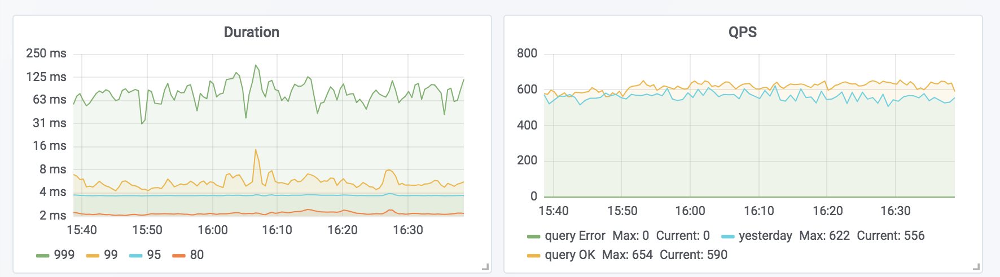
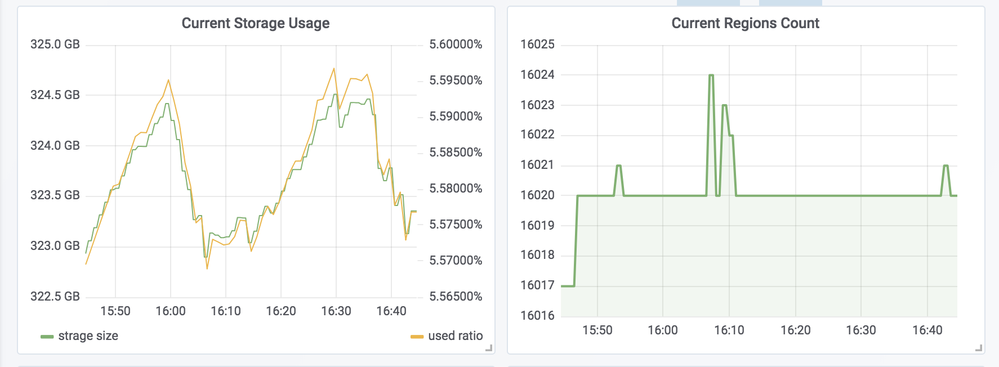

# TiDB 在挖财的选型和应用

### 挖财介绍

挖财诞生于 2009 年 6 月，于国内率先推出个人记账理财工具，现已发展成为一家涵盖记账、管钱、理财、信用、社区等服务于一体的全方位的互联网财富管理平台。

### 本文主要内容

1. 当前技术栈所面临的困难。
2. 应用新的存储所做的比较和选型。
3. 实际场景中，TiDB 的应用情况。
4. 以及之后我们想围绕 TiDB 做的一些事情。

### 当前技术栈

HBase 是我们这边使用的主要存储系统，提供 OLTP 服务能力。HBase 接口简单，但接入需要做不少的工作，而且需要去了解 HBase 的概念，对业务使用方来讲，是应该避免的负担。所以基于此，又引入了 Phoenix 提供 SQL 接口，以便于业务快速上马。在去年我来到挖财之前，这套系统运行了大概一年，期间基本没出现什么大问题。
随着后来业务发展，开始频出问题。大部分是 Phoenix 自身的设计导致。比如：

- 索引写入失败直接导致 hbase 退出以及索引数据不一致。

- meta 表成为访问热点(默认所有请求都会去读取最新的 meta 信息)。

- 配置 `update_cache_frequency` 又会引起 meta 信息不同步的问题。

- 甚至还有添加索引导致集群崩溃的情况。

以上只是冰山一角，我们花了非常多的时间来跟踪处理这些问题。内部版本与官方版本越走越远，升级变得很困难，加上社区很小，我们内部人员也不多（其实就两三个人在搞，我自己算是比较 focus 在这上面，但越看代码越是对 Phoenix 失望），我们意识到 Phoenix 并不是一个可以长久使用的 SQL 方案。

另外 HBase 是一个 CP 模型，可用性谈不上高。所以，去年年底，在将 HBase 的业务稳定下来之后，我们开始着手调研其他的路子。

### 新存储的调研和选型

调研之初，列了几个需要满足的条件：

1. 大容量，水平扩展。
2. 可用性要好。
3. 分布式事务，保证索引数据一致。
4. 最好是 SQL 接口。

在当时，符合这些要求的其实也就两个：TiDB 和 CockroachDB。（放到现在可能还会加上 FoundationDB）

在阅读了不少 TiDB 和 CockroachDB 的文章后，我倾向于 TiDB 。有这样几个原因：

1. 兼容 MySQL 协议，公司内部各种 MySQL 配套设施基本都可以无缝对接。虽然 CRDB 也兼容 PG 协议，但毕竟业务方已经习惯了 MySQL 的用法。
2. TiDB 和 CRDB 在[全局时钟的实现](https://pingcap.com/blog/Time-in-Distributed-Systems/)上选择了不同的方案，而 TiDB 的选择更契合公司现阶段的的状况。
3. 最后是可控度。之前看过部分 TiKV 的代码（出于学习 Rust 和 Raft 的目的），自信能够在短时间内定位存储层出现的大部分问题。

后面对 TiDB 和 CRDB 做了一些对比测试（版本都是 1.x 版本，具体方法是在相同机器上分别部署 tidb 和 crdb，利用 sysbench 测试写入和 tp 查询时的性能表现）。实测下来，有以下几个体验：

1. TiDB 部署起来略麻烦，从组件和配置参数个数上，CRDB 数量比 TiDB 少。TiDB 提供 ansible 脚本，可以一键部署，但毕竟组件多，使用起来还是需要多加注意。
2. CRDB 稳定性不如TiDB。测试过程中，CRDB 出现 OOM 的情况。另外，聚合查询的时间差别很大，有时候甚至达一倍之多。相比，TiDB 足够稳定，多次查询性能都很接近。个人猜测，这应该和 TiDB 存储层使用 Rust 编写有关。
3. TiDB（在关闭 `sync_log` 的情况） 写入性能上完胜。这一点确是始料未及的。CRDB 不知道是内部实现问题，还是未提供类似 sync_log 的配置参数，写入性能只有几千 QPS。（最新版 CRDB 2.0 宣称写入性能有极大的提升，有兴趣的朋友可针对新版做测试）
4. 查询方面（点查，范围查），测试显示两者差距不是很大。

最终，我们选择了 TiDB。TiDB 提供了：

1. Raft 协议保证一致性的同时，提高了整个系统的可用性。
2. 2PC 事务，保证数据索引一致。
3. Online, Async Schema Change，高效且 '安全' 的 Schema 变更操作，运维友好程度 Max。

TiDB 的这些特性正好解决（或者说不存在）了 Phoenix/HBase 的很多缺点。

### TiDB 的上线和应用

部署使用的是官方提供的 tidb-ansible 脚本，在此基础上做了一些改动，以适配内部的运维环境。具体部署情况如下：

| 机器                              | pd   | tikv | tidb |
| --------------------------------- | ---- | ---- | ---- |
| server1(40C，252 GB，6 * 2T SATA) | 1    | 3    | 1    |
| server2(40C，252 GB，6 * 2T SATA) | 1    | 3    | 1    |
| server3(40C，252 GB，6 * 2T SATA) | 1    | 3    | 1    |

部署之后，我们使用压测脚本 fake 了一些读写流量，打到 tidb 集群中，线上稳定跑了1个多月。期间经过两次rc 版本升级，过程比较顺利。 pd 和 tikv 升级过程中，会有少量请求因为 retry backoff，导致请求时长变高，几百毫秒到几秒不等。

目前，TiDB 在本部门已逐步使用起来。内部一个设备标识系统（重索引，写入、更新比较频繁）已经从 Phoenix/HBase 切换到 TiDB ，线上稳定运行有一个多月，tidb qps 稳定在  500 左右，数据量在 300G 左右。具体切换过程这里不展开讲，最终的结果是，业务更加稳定，schema 操作变得十分方便，大大加快了业务的推进。部门其他业务也在接入过程中。

在实际使用过程中，我们也发现一些小坑。 MySQL 协议的兼容问题遇到一两个，不过不重要，提给官方，可以得到快速的解决。给我印象比较深的一个坑是：线上观察到  TiKV KV Engine Seek 时间过长，达几 ms 之多。后经过 PingCAP团队的帮助，调整 `tikv_gc_concurrency`,`tikv_gc_run_interval` 参数之后，恢复正常。 我们的业务数据更新比较频繁，gc 不及时的话，历史版本积累过多，会引发上述问题。

### 未来计划

未来考虑将部分 AP 业务迁移到 TiDB。目前有两条路可以走：

1. 利用 TiSpark 接入到 TiDB 集群，提供实时查询分析能力。TiSpark 保证 spark 查询应用到 TiKV 上的优先级最低，保证了 TP 业务的优先处理。优点，零成本搭建。缺点是，隔离程度不高，具体的效果有待实际应用后再行观察。
2. 利用 binlog 同步，构建备份集群。所有 AP 查询走备份集群。优点是，物理隔离。缺点是，binlog 同步方案比较重，且目前不开源，可用性未知。

未来还考虑在 TiKV 的基础上，构建 Redis 协议的存储。TiKV 的高稳定性，高扩展性，简单的KV 接口，分布式事务实现，使得构建更丰富的存储模型成为可能。毕竟，我们的征途是星辰大海。

### 致谢

最后，非常感谢 PingCAP 的团队，在我们应用 TiDB 的过程中，给与的强大支持。