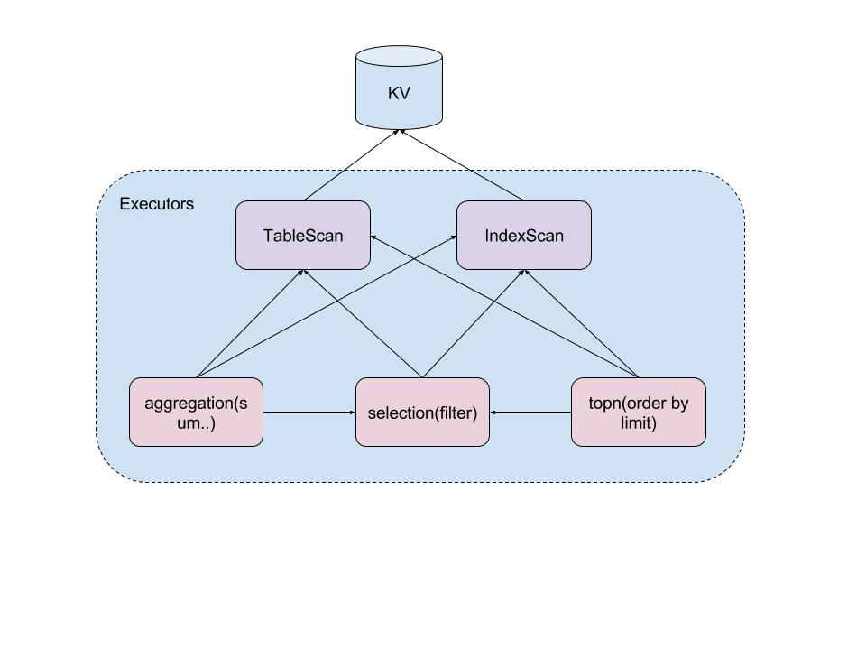
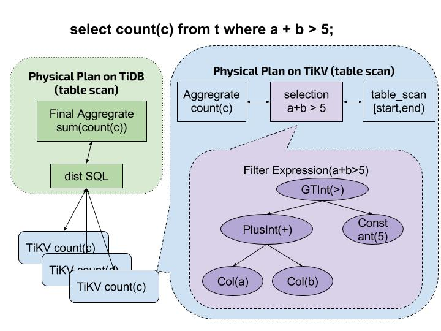
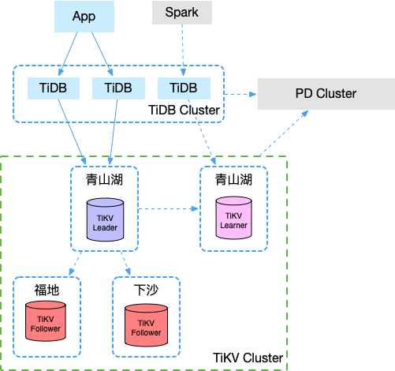
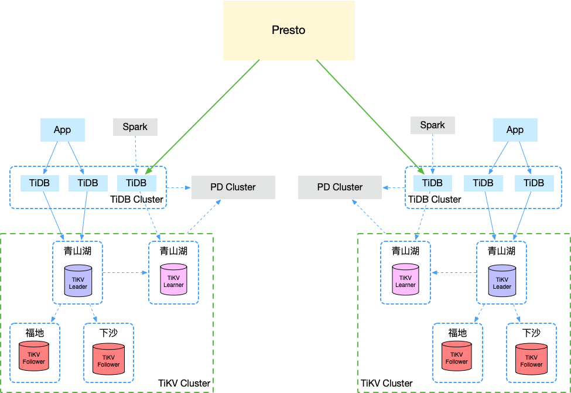

<!-- toc -->

# TiDB


- [x] 概览
- [x] Storage - RocksDB
- [x] Replication - Raft protocol
- [x] Schedule - PD
- [x] SQL Layer
- [ ] Transaction - 2PC/MVCC
- [ ] Monitoring - Prometheus && Grafana

------

## 概览

**HBase 出了什么问题**

- 可用性差
  - GC
  - 恢复时间长
- 无跨行事务 - Mistake of Jeaf Dean
  - 决定了它只合适做一个 KV 数据库

**需要考虑什么**

- 一致性：我们是否需要保证整个系统的线性一致性，还是能容忍短时间的数据不一致，只支持最终一致性。
- 稳定性：我们能否保证系统 7 x 24 小时稳定运行。系统的可用性是 4 个 9，还有 5 个 9？如果出现了机器损坏等灾难情况，系统能否做的自动恢复。
- 扩展性：当数据持续增多，能否通过添加机器就自动做到数据再次平衡，并且不影响外部服务。
- 分布式事务：是否需要提供分布式事务支持，事务隔离等级需要支持到什么程度。

------


**可用性**

- Rust
  - static language。
  - no GC。
  - Memory safe，avoid dangling pointer，memory leak。
  - Thread safe，no data race。
  - package manager。
  - C bindings，zero-cost。
  - not so easy to learn。
  - not so many libraries as Java or C++。
- 多副本（Raft）
  - 数据写入只有**大多数副本节点写入成功**才算成功。
  - 一个副本节点 down，可以切换到其他副本节点。

**跨行事务 -** 2PC

基于跨行事务，可以实现 SQL-based 的数据库。

**GRPC API**

- Get
- Scan
- BatchGet
- Prewrite
- Commit

------

## 数据存储


------

## 数据复制

### 一致性协议 Raft

> 超级棒的 Slide http://thesecretlivesofdata.com

### Raft in TiKV


- 每个 Region 有三个副本（Replica），副本之间构成一个 Raft Group。

  （Replica 分布在不同的 TiKV 节点上，其中 Leader 负责读/写，Follower 负责同步 Leader 发来的 raft log）

- 请求到 Region Leader 的写请求的数据通过 Raft 协议，在三个副本之间达成一致。

- 整个 KV 空间由许多个 Raft Group 构成。


### 关于 CAP

> Choose Availability or Consistency when Partitioned.

- 在保证一致性的前提，尽可能的提高可用性。[why you should pick strong consitency whenever possible - from google cloud blog](https://cloudplatform.googleblog.com/2018/01/why-you-should-pick-strong-consistency-whenever-possible.html)
- Raft 可容忍少数节点的离线（宕机或者网络不可达）。


### 容灾

- **单机房多副本**，副本在不同节点上。
  - 可容忍单节点故障。
  - 事务提交操作没有跨机房日志同步操作，对事务响应时间影响最小。
- **同城三机房**，每个机房一个数据副本。
  - 可容忍单机房故障。
  - 事务提交操作需要在同城机房间进行日志同步，对事务响应时间影响较小。
- **两地三机房**，可以使用3个副本或者5个副本。
  - 可容忍单机房故障，亦可容忍存放单机房的城市发生故障。
  - 事务大概率在同城机房间进行日志同步，对事务响应时间影响较小；但一旦同城的两个机房中一个机房发生故障，事务提交就需要跨城日志同步，对事务响应时间影响较大。
- **三地三机房**，多使用5个副本。
  - 容忍城市级故障。
  - 事务提交操作需要跨城进行日志同步，对事务响应时间影响较大。

------

## 数据调度

### 为什么调度

负载与分布：

- 保证请求均匀分布到节点上。
- 保证节点存储容量均匀。
- 保证数据访问热点分布均匀。
- 保证副本数量不多不少，并且分布在不同机器上。
- 避免集群 Balance 影响服务。

扩容缩容：

- 增加节点以及下线节点后，保证数据均匀分布。

数据容灾：

- 少数节点失效后，保证服务正常，以及负载和分布均衡。
- 跨机房部署时，某个机房掉线后，保证不丢失数据甚至是保证正常服务。

### 调度的基本单元

- 增加一个 Replica
- 删除一个 Replica
- 将 Raft Leader 从 一个 Replica 转移到另一个 Replica

### 集群信息收集

收集每个TiKV 节点的信息，以及每个 Region 的状信息。

- 节点定时上报的信息。
  - 磁盘总量，可用磁盘容量。
  - 包含的 Region Replica 个数。
  - 数据写入速度。
  - 是否过载。
  - Label 信息。
  - 其他...
- Region 的 Raft Leader 上报信息。
  - Leader/Follower 所在的节点。
  - 掉线的 Replica 个数。
  - Region 写入和读取的速度。
  - 其他...

 **通过管理接口传递进来的外部信息，做更准确的决策。**

- 主动下线某个节点。
- 主动迁移某些热点 Region。
- 其他...

### 调度计划

- **一个 Region 的 Replica 数量正确**
- **一个 Raft Group 中的多个 Replica 不在同一个==位置==**
- **副本在 Store 之间的分布均匀分配**
- **Leader 数量在 Store 之间均匀分配**
- **访问热点数量在 Store 之间均匀分配**
- **各个 Store 的存储空间占用大致相等**
- **控制调度速度，避免影响在线服务**
- 其他。。（可在 PD 中实现自定义的调度策略）

### 调度实现

1. PD 不断的通过 Store 或者 Leader 的心跳包收集信息，获得整个集群的详细数据
2. 每次收到 Region Leader 发来的心跳包时，根据以上信息以及调度策略**==生成调度操作序列==**。
3. 通过心跳包的返回消息，将需要进行的操作返回给 Region Leader，并在后面的心跳包中监测执行结果。

------

## SQL Layer


TiDB 对：

- 每个表分配一个 TableID，
- 每一个索引都会分配一个 IndexID，
- 每一行分配一个 RowID（如果表有整数型的 Primary Key，那么会用 Primary Key 的值当做 RowID）
- 其中 TableID 在整个集群内唯一，IndexID/RowID 在表内唯一，这些 ID 都是 int64 类型


Record Data: `t_${table_id}_r_${handle}` => `${v1}${v2}${..}`

Uniq Index Data: `t_${table_id}_i_${index_id}${v1}${v2}`=>`${handle}`

Non-Uniq Index Data: `t_${table_id}_i_${index_id}${v1}${v2}${v...}${handle}` => `null`

------

## Coprocessor


执行计划落地：





----------

## The Future - TiDB 3.0






## TODO: Transaction - 2PC/MVCC

## 编码格式

DB

- `m + DBs + h + DB:[db_id]` => `TiDBInfo`
- `m + DB:[db_id] + h + Table:[tb_id]` => `TiTableInfo`

```json
    {
        "id":130,
        "db_name":{"O":"global_temp","L":"global_temp"},
        "charset":"utf8",
        "collate":"utf8_bin",
        "state":5
    }
```

```json
    {
       "id": 42,
       "name": {
          "O": "test",
          "L": "test"
       },
       "charset": "",
       "collate": "",
       "cols": [
          {
             "id": 1,
             "name": {
                "O": "c1",
                "L": "c1"
             },
             "offset": 0,
             "origin_default": null,
             "default": null,
             "type": {
                "Tp": 3,
                "Flag": 139,
                "Flen": 11,
                "Decimal": -1,
                "Charset": "binary",
                "Collate": "binary",
                "Elems": null
             },
             "state": 5,
             "comment": ""
          }
       ],
       "index_info": [],
       "fk_info": null,
       "state": 5,
       "pk_is_handle": true,
       "comment": "",
       "auto_inc_id": 0,
       "max_col_id": 4,
       "max_idx_id": 1
    }
```


## 代码目录说明

#### structure

TxStructure 包装 `kv.Retriever` 和 `kv.RetrieverMutator` 来操作 `string`, `list`, `hash` 类型。

#### meta

Meta: 封装 `TxStructure` 来操作 meta 相关的信息。
Id Allocator: id genertor 封装。

#### model

schema, table, index 等数据结构 存入底层 kv 时的 json 格式。

#### table

table，index， column 相关的抽象，用来操作数据。

#### tablecodec

数据编码。

#### terror

错误码。

#### types

mysql 类型封装。

#### distsql

对 `kv.Response` 的封装。

- streaming(`stream.go`)
  调用 `kv.Response` 的 `Next` 方法，返回的数据是 `tipb.StreamResponse`(one chunk a time)。
- select(`distsql.go`)
  调用 `kv.Response` 的 `Next` 方法，返回的数据是 `tipb.SelectResponse`(many chunk)。

TODO:

- [ ] implementation of `kv.Response`
